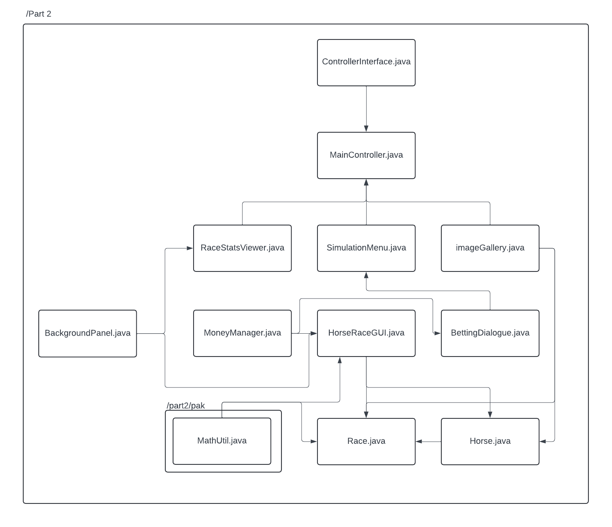

# Horse Simulator

A horse simulator in which you can create your own horse and race it against opponent horses. Select your track and your horse, give it a name and its off to the races. Keep track of all your previous races and place your own bets.


## Installation With CLI

Before installing please check [Environment Variable](#environment-variables)


Run the console version by using ```cd``` and run the following command:

```bash
  java -jar RunConsole.jar
```
    
## Installation With .Jar

You also have the option to run the GUI using the .jar file. To run this simply double click ```MainController.jar```
## Installation Through IDE

If you would like to run the code through an IDE run `MainController.java` for a graphical interface or for the console run `RunConsole.java`

*DO NOT CHANGE THE STRUCTURE OF THE DIRECTORY*

This will cause errors to occur. Check the dependency graph
## Environment Variables

To run this project, you will need to add the following environment variables to your path

`C:\Program Files\Common Files\Oracle\Java\javapath`

Install Java [here](https://www.oracle.com/java/technologies/downloads/)

## Dependency Graph


